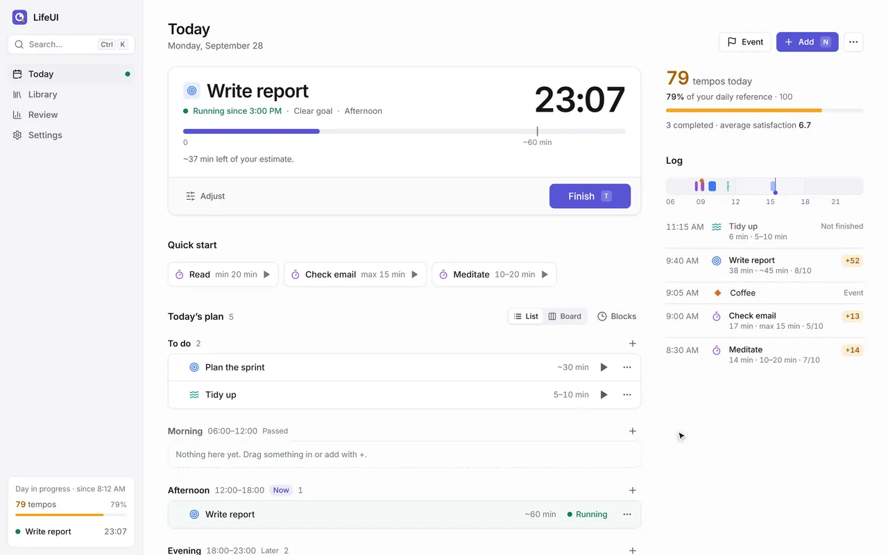
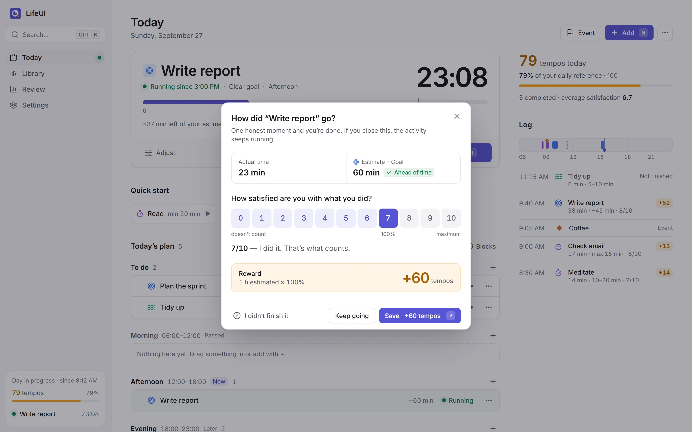
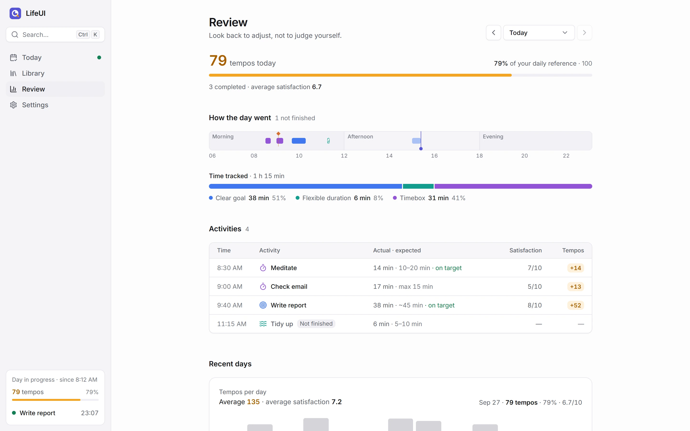
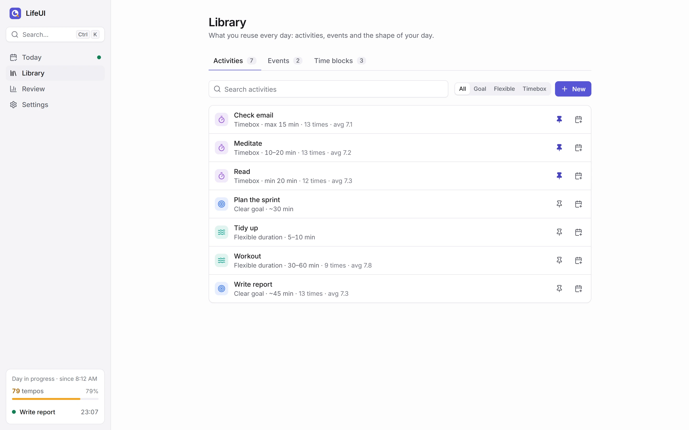
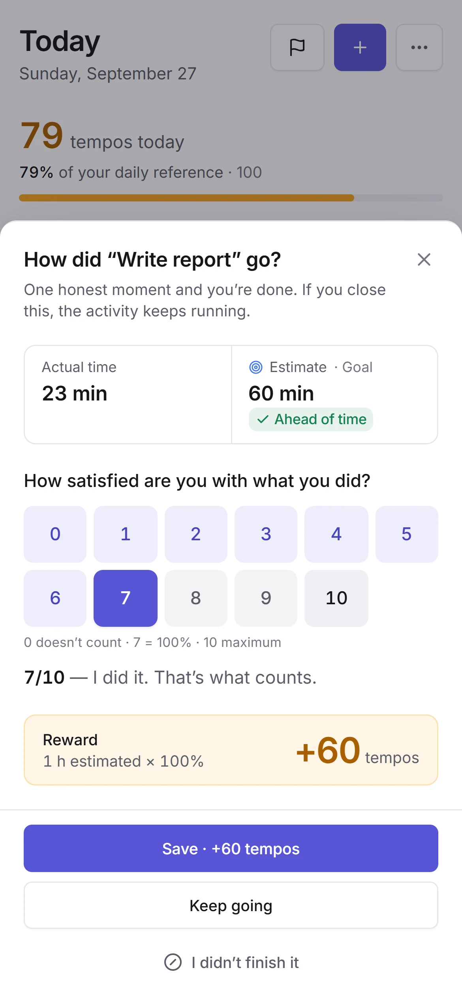
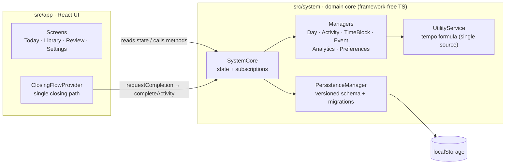

# LifeUI

A HUD for real life: plan the day in time blocks, run one activity at a time, and close each one with a single honest self-assessment that earns tempos.

[Live app](https://life-ui-one.vercel.app) · [Case study](https://portfolio-felix-teal.vercel.app/work/lifeui/) · Built by [Felix Andersson](https://portfolio-felix-teal.vercel.app/)

<picture>
  <source media="(prefers-color-scheme: dark)" srcset="docs/screenshots/lifeui-demo-dark.webp">
  
</picture>

<sub>Screenshots use synthetic demo data. They follow your GitHub theme (light or dark).</sub>

## What it is

LifeUI is not a todo app, a habit tracker or a time tracker. You keep a library of activities you repeat, drop them into the day's time blocks (Morning, Afternoon, To do), and run exactly one at a time. Only To do and the block you are in right now can be started. What is running, and for how long, is always on screen, in the tab title, and in a floating bar on mobile.

Every ending (finishing, switching to something else, ending the day) goes through one closing ritual: how satisfied are you with what you did, from 0 to 10? The answer earns tempos, computed as `ceil(base minutes × score / 7)`, where the base is your estimate when there is one and the real time otherwise. A 7 is 100%, and a 0 counts nothing. Tempos only go up: no streaks, no penalties, and free time costs nothing. The daily target is a reference shown as a percentage, never as what is missing.

<table>
  <tr>
    <td width="50%" valign="top">
      <picture>
        <source media="(prefers-color-scheme: dark)" srcset="docs/screenshots/lifeui-closing-dark.webp">
        
      </picture>
      <p><b>Closing ritual.</b> One honest moment per activity. The reward preview is the reward.</p>
    </td>
    <td width="50%" valign="top">
      <picture>
        <source media="(prefers-color-scheme: dark)" srcset="docs/screenshots/lifeui-review-dark.webp">
        
      </picture>
      <p><b>Review.</b> The day hour by hour, time by activity type, and the trend across days.</p>
    </td>
  </tr>
  <tr>
    <td width="50%" valign="top">
      <picture>
        <source media="(prefers-color-scheme: dark)" srcset="docs/screenshots/lifeui-library-dark.webp">
        
      </picture>
      <p><b>Library.</b> Three duration contracts: a clear goal with an estimate, a flexible range, or a timebox with a minimum, a maximum or both.</p>
    </td>
    <td width="50%" valign="top" align="center">
      <picture>
        <source media="(prefers-color-scheme: dark)" srcset="docs/screenshots/lifeui-mobile-dark.webp">
        
      </picture>
      <p><b>On a phone.</b> The same ritual as a bottom sheet, with touch-sized targets.</p>
    </td>
  </tr>
</table>

The interface is available in English and Spanish. It opens in English on first launch and can be switched to Spanish in Settings or from the command palette.

## How it's built

The domain logic and the UI are separate layers. The UI never re-implements a rule: it reads state and calls the core.



- **Framework-free domain core.** [`src/system`](src/system) is plain TypeScript with no React imports. `SystemCore` ([`index.tsx`](src/system/index.tsx)) applies every change to a copy of the state, persists it, then notifies subscribers. Managers own each area (days, activities, time blocks, events, analytics, preferences). The UI reaches the core through one adapter, [`src/app/state/system.tsx`](src/app/state/system.tsx), and the UI tests drive a real `SystemCore` instead of mocks.
- **Versioned persistence with migrations.** [`persistenceManager.ts`](src/system/persistenceManager.ts) runs every load through parse, validate, migrate (schema v1 to v2 to v3), sanitize. Fields removed in v3 are moved into a `legacyArchive` object instead of being discarded. JSON import in Settings goes through the same path as a normal load, and export produces the same format that goes to `localStorage`.
- **Preview equals result.** The closing dialog ([`ClosingDialog.tsx`](src/app/features/activity/ClosingDialog.tsx)) calls `UtilityService.resolveBaseMinutes` and `calculatePreviewTempos`, the same functions the core uses in `calculateTemposAwarded` ([`utilityService.ts`](src/system/utilityService.ts)). The number on the Save button is the number that gets stored.
- **One closing path.** Finishing, switching activity and ending the day all run through `requestCompletion → dialog → completeActivity | interruptActivity` ([`src/app/state/closing.tsx`](src/app/state/closing.tsx)). The next action only runs if the close was saved, and dismissing the dialog leaves the activity running.
- **Typed i18n with no dependencies.** [`es.ts`](src/app/i18n/es.ts) is the reference copy and defines `MessageKey`; [`en.ts`](src/app/i18n/en.ts) is typed `Record<MessageKey, string>`, so a missing or extra key fails the type check. A test checks that both languages use the same `{placeholders}` in every string. Plurals use `Intl.PluralRules`, and dates and numbers use `Intl` in the active language.
- **CI.** [`.github/workflows/ci.yml`](.github/workflows/ci.yml) runs on every push to `main` and on pull requests: typecheck, lint with zero warnings allowed, Jest, the production build, and then Cypress against the built app.
- **Offline-first.** No backend. All data stays in the browser, and Settings can export and import a JSON backup.

## Stack

React 18, TypeScript (strict), Vite, React Router, Tailwind CSS with CSS-variable design tokens (light and dark follow the system), Radix UI primitives, `@hello-pangea/dnd`, Inter (self-hosted), Jest with Testing Library, Cypress, GitHub Actions, Vercel.

## Getting started

Requires Node 20 or newer.

```bash
git clone https://github.com/Felichz/life-ui.git
cd life-ui
npm install
npm run dev          # http://localhost:5174
```

| Script              | What it does                                            |
| ------------------- | ------------------------------------------------------- |
| `npm run dev`       | Vite dev server on port 5174                            |
| `npm run build`     | Type-check and build for production into `dist/`        |
| `npm run preview`   | Serve the production build on port 5174                 |
| `npm run typecheck` | Type-check the app, tooling and Cypress projects        |
| `npm run lint`      | ESLint with Prettier, zero warnings allowed             |
| `npm test`          | Unit and integration tests (Jest)                       |
| `npm run test:e2e`  | End-to-end run in Cypress (needs `npm run dev` running) |

Keyboard: `Ctrl/⌘ K` command palette · `N` add activity · `E` log event · `T` finish the running activity · `G` then `H`/`B`/`R`/`A` to navigate · `0` to `9` to score in the closing ritual.

## Testing

252 Jest tests across 15 suites, plus 5 Cypress end-to-end tests.

- **Core** ([`src/system/__tests__`](src/system/__tests__)): unit tests for the managers, the tempo formula and persistence (including migrations and import), plus integration tests for starting a day, the library, planning, and the closing ritual.
- **UI** ([`src/app/__tests__`](src/app/__tests__)): view-logic tests, i18n key and placeholder parity, and flow tests that render the real app against a real `SystemCore`: closing with the previewed reward, switching activity through the ritual, cancelling, "I didn't finish it", and quick starts.
- **End to end** ([`cypress/e2e/journey.cy.ts`](cypress/e2e/journey.cy.ts)): first run through ending the day in the browser, mobile navigation, the language switch, and redirects from the old Spanish routes.

The 1x PNG screenshots in `docs/screenshots/` are generated by a separate Cypress spec with synthetic demo data (`npm run dev` must be running):

```bash
npx cypress run --config-file cypress.screenshots.config.ts
```

## Project structure

```
src/
  system/              domain core: SystemCore, managers, UtilityService, persistence
    __tests__/         unit and integration tests for the core
  app/
    state/             core adapter, closing flow, theme, toasts
    features/          today, library, review, settings, plus the activity dialogs
    components/ui/     design-system primitives (Button, Dialog, Menu, Tooltip...)
    shell/             app shell, sidebar, command palette
    i18n/              typed EN/ES messages
    lib/               formatting and read-only view helpers
  types.ts             shared domain types
cypress/e2e/           end-to-end journey and README screenshot specs
docs/adr/              architecture decision records
```

## Decisions

- [ADR-001: the tempo system](docs/adr/001-tempo-system.md): the reward formula and what was deliberately removed.
- [`PRODUCT.md`](PRODUCT.md): users, purpose and product principles.
- [`DESIGN.md`](DESIGN.md): the visual system (tokens, type, components, rules).

## Deploying

A static SPA. On Vercel, import the repo and deploy: [`vercel.json`](vercel.json) sets the Vite build, the SPA rewrite for client-side routes, and long-term caching for hashed assets.

## License

[MIT](LICENSE) © Felix Andersson
