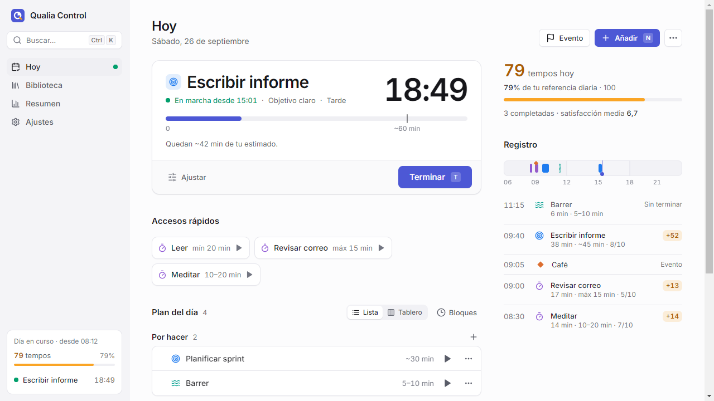
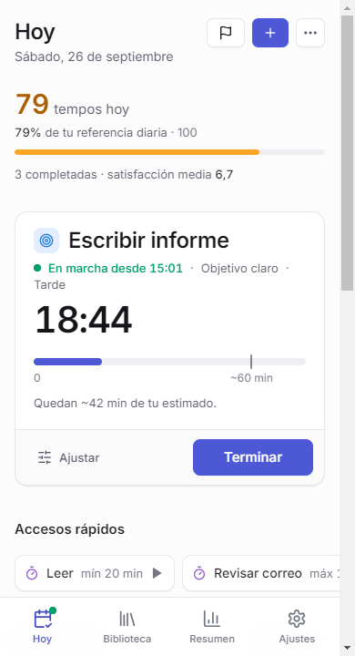
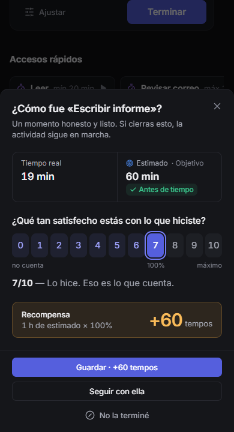
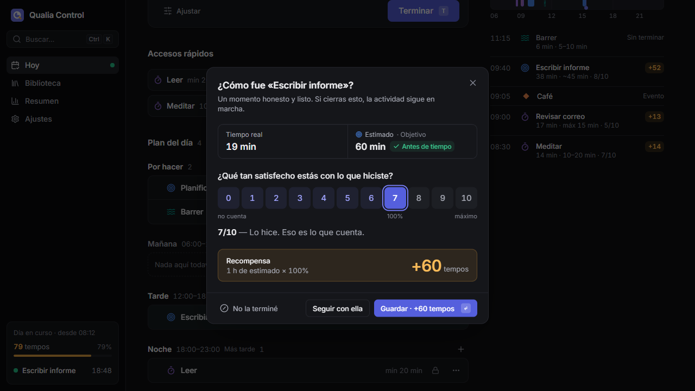
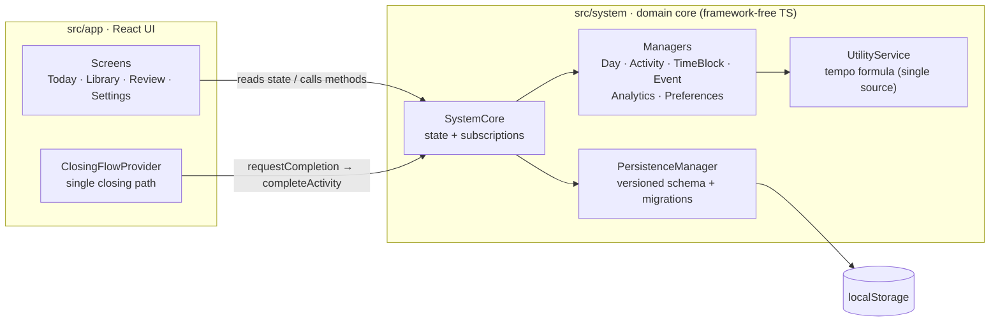

# Qualia Control

**A HUD for real life.** Plan your day, focus on one thing at a time, and close each activity with an honest self-assessment that earns _tempos_, a reward that only ever goes up.

Built for (and by) someone with ADHD: one obvious next action, what's running always visible, no streaks, no debt, and free time never costs anything.

> The interface is in Spanish. Code, architecture and this README are meant to be readable by anyone.

<p align="center">
  
</p>

<p align="center">
  
  &nbsp;
  
</p>

## How it works

1. **Library.** Save the activities you repeat, each with a duration contract:
   - _Clear objective_: has an end; you estimate it (`~45 min`).
   - _Flexible_: varies within a known range (`5–10 min`).
   - _Timebox_: you commit to a minimum, a maximum or both, and get notified when you reach them.
2. **Plan.** Drop them into the day's time blocks (Morning, Afternoon…) or _To do_. Only _To do_ and the block you're in right now can be started.
3. **Focus.** Exactly one activity runs at a time. The timer and its progress against the contract are always on screen, in the tab title, and in a floating bar on mobile.
4. **The closing ritual.** Every ending (finishing, switching to something else, ending the day) goes through one dialog: _how satisfied are you with what you did, 0–10?_

   `tempos = ceil(base minutes × score / 7)`, where the base is your estimate when there is one and the real time otherwise. A 7 is 100%. A 0 counts nothing, and "I didn't finish it" is recorded without judgment.

5. **Review.** Each day's tempos against a daily reference (shown as a percentage, never as what's "missing"), what actually happened hour by hour, and the trend across days.

<p align="center">
  
</p>

## Architecture

The domain logic and the UI are separate layers. The UI never re-implements a rule: it reads state and calls the core.



- **`src/system`** is plain TypeScript with no React. `SystemCore` owns an immutable state tree, persists every change, and notifies subscribers. Managers encapsulate each area, and the persistence layer versions the schema and migrates old data (v1 → v3).
- **`src/app`** is the React UI. `state/` wraps the core in a provider plus the closing flow, `features/` holds one folder per screen, `components/ui` holds the design-system primitives, and `lib/` holds formatting and read-only view helpers.
- **One closing path.** Finishing, switching activity and ending the day all run through `requestCompletion → dialog → completeActivity | interruptActivity`. The next action only runs if the close was saved, and dismissing the dialog leaves the activity running.
- **Preview = result.** The reward preview in the dialog calls the same `UtilityService` functions the core uses to award tempos, so what you see is what you get.
- **Offline-first.** No backend, and all data stays in the browser. Settings can export and import a JSON backup.

Decisions are documented rather than implied:

- [`docs/adr/001-sistema-de-tempos.md`](docs/adr/001-sistema-de-tempos.md): the tempo system and what was deliberately removed.
- [`PRODUCT.md`](PRODUCT.md): users, purpose and product principles.
- [`DESIGN.md`](DESIGN.md): the visual system (tokens, type, components, rules).

## Tech stack

React 18 · TypeScript (strict) · Vite · Tailwind CSS with CSS-variable tokens (light/dark follows the system) · Radix UI primitives · `@hello-pangea/dnd` · Inter (self-hosted) · Jest + Testing Library · Cypress

## Getting started

Requires Node 20+.

```bash
npm install
npm run dev          # http://localhost:5174
```

| Script              | What it does                                                |
| ------------------- | ----------------------------------------------------------- |
| `npm run build`     | Type-check and build for production into `dist/`            |
| `npm run typecheck` | Type-check app, tooling and Cypress projects                |
| `npm run lint`      | ESLint + Prettier, zero warnings allowed                    |
| `npm test`          | Unit and integration tests (Jest)                           |
| `npm run test:e2e`  | End-to-end run through the whole day (Cypress, needs `dev`) |

Keyboard: `Ctrl/⌘ K` command palette · `N` add activity · `E` log event · `T` finish the running activity · `G` then `H`/`B`/`R`/`A` to navigate · `0–9` to score in the closing ritual.

## Testing

- **Core:** unit tests for every manager plus integration tests for the main flows (starting a day, library, planning, the closing ritual, persistence and migrations).
- **UI:** view-logic tests and flow tests that render the real app against a real `SystemCore`. They cover closing with the previewed reward, switching activity through the ritual, cancelling, "I didn't finish it", and quick starts.
- **End to end:** one Cypress spec walks the whole product in the browser, from first run through ending the day, plus a mobile check.

## Deploying

It's a static SPA. On Vercel, import the repo and deploy: [`vercel.json`](vercel.json) sets the Vite build, the SPA rewrite for client-side routes, and long-term caching for hashed assets.

## License

[MIT](LICENSE) © Felix Andersson
